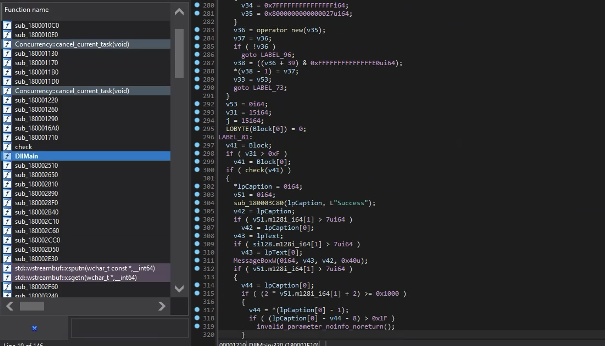
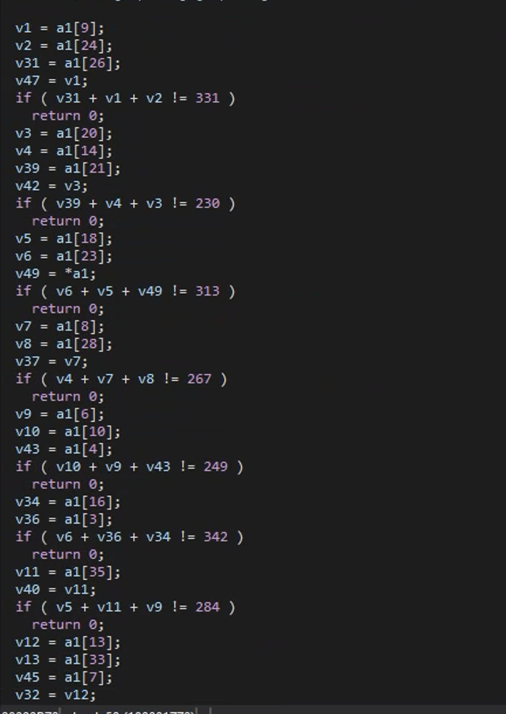

# Medium - Real Chrome

| Creater: ShallowFeather


這題主要使用了 Dll-side-loading 的手法
透過 chrome 當中其中一個 Dll VERSION.dll 來實現

主要就是讓他利用 dll-side-loading load 上去並且在 dll 附加上去時便會執行 checker function

當中邏輯為讀入 flag.txt 並丟入進行檢查

參賽者可透過 Success 訊息判斷 checker function 位置

利用 ida 進行分析時可以看到


在 check function 中主要則為 flag 的檢查，主要會檢查50次不同字元相加結果

可以直接推斷出可使用 z3 進行解題



```py
from z3 import *

f = "TSC{d11-sld3_10AdIng_Wwww_haha_owob}"


flag = [BitVec(f'flag{i}', 8) for i in range(len(f))]


s = Solver()


s.add(flag[9] + flag[26] + flag[24] == 331)
s.add(flag[14] + flag[21] + flag[20] == 230)
s.add(flag[18] + flag[23] + flag[0] == 313)
s.add(flag[14] + flag[28] + flag[8] == 267)
s.add(flag[10] + flag[6] + flag[4] == 249)
s.add(flag[16] + flag[23] + flag[3] == 342)
s.add(flag[6] + flag[18] + flag[35] == 284)
s.add(flag[33] + flag[7] + flag[13] == 205)
s.add(flag[33] + flag[20] + flag[20] == 301)
s.add(flag[5] + flag[30] + flag[15] == 209)
s.add(flag[23] + flag[24] + flag[32] == 357)
s.add(flag[6] + flag[34] + flag[35] == 272)
s.add(flag[33] + flag[4] + flag[28] == 315)
s.add(flag[8] + flag[16] + flag[15] == 280)
s.add(flag[30] + flag[33] + flag[33] == 317)
s.add(flag[32] + flag[11] + flag[7] == 215)
s.add(flag[6] + flag[18] + flag[11] == 210)
s.add(flag[17] + flag[5] + flag[3] == 245)
s.add(flag[31] + flag[32] + flag[20] == 325)
s.add(flag[34] + flag[6] + flag[27] == 244)
s.add(flag[9] + flag[13] + flag[2] == 224)
s.add(flag[20] + flag[7] + flag[14] == 188)
s.add(flag[23] + flag[10] + flag[17] == 292)
s.add(flag[28] + flag[18] + flag[1] == 297)
s.add(flag[23] + flag[29] + flag[1] == 299)
s.add(flag[29] + flag[13] + flag[31] == 257)
s.add(flag[16] + flag[17] + flag[6] == 222)
s.add(flag[13] + flag[9] + flag[17] == 230)
s.add(flag[15] + flag[26] + flag[33] == 280)
s.add(flag[21] + flag[23] + flag[26] == 310)
s.add(flag[13] + flag[9] + flag[23] == 276)
s.add(flag[23] + flag[22] + flag[8] == 353)
s.add(flag[5] + flag[17] + flag[17] == 195)
s.add(flag[25] + flag[9] + flag[12] == 298)
s.add(flag[23] + flag[35] + flag[4] == 344)
s.add(flag[35] + flag[18] + flag[27] == 332)
s.add(flag[27] + flag[19] + flag[6] == 249)
s.add(flag[27] + flag[11] + flag[32] == 267)
s.add(flag[32] + flag[11] + flag[14] == 218)
s.add(flag[34] + flag[14] + flag[0] == 230)
s.add(flag[11] + flag[17] + flag[27] == 221)
s.add(flag[8] + flag[32] + flag[10] == 334)
s.add(flag[34] + flag[12] + flag[31] == 304)
s.add(flag[1] + flag[30] + flag[34] == 276)
s.add(flag[12] + flag[21] + flag[29] == 279)
s.add(flag[22] + flag[16] + flag[22] == 338)
s.add(flag[26] + flag[0] + flag[35] == 313)
s.add(flag[10] + flag[8] + flag[31] == 326)
s.add(flag[14] + flag[31] + flag[18] == 269)
s.add(flag[18] + flag[9] + flag[13] == 267)
s.add(flag[2] + flag[34] + flag[29] == 262)
s.add(flag[29] + flag[17] + flag[27] == 267)
s.add(flag[25] + flag[29] + flag[2] == 259)
s.add(flag[19] + flag[2] + flag[10] == 270)
s.add(flag[9] + flag[0] + flag[13] == 241)
s.add(flag[11] + flag[14] + flag[16] == 199)
s.add(flag[3] + flag[3] + flag[20] == 341)
s.add(flag[14] + flag[4] + flag[3] == 271)
s.add(flag[13] + flag[10] + flag[25] == 244)
s.add(flag[19] + flag[10] + flag[15] == 268)
s.add(flag[23] + flag[26] + flag[33] == 334)
s.add(flag[34] + flag[30] + flag[18] == 303)
s.add(flag[14] + flag[14] + flag[31] == 207)
s.add(flag[10] + flag[26] + flag[29] == 301)
s.add(flag[31] + flag[32] + flag[33] == 341)
s.add(flag[23] + flag[4] + flag[35] == 344)
s.add(flag[17] + flag[0] + flag[14] == 205)
s.add(flag[19] + flag[13] + flag[12] == 247)
s.add(flag[30] + flag[7] + flag[15] == 205)
s.add(flag[23] + flag[2] + flag[9] == 294)

s.check()

m = s.model()
for i in range(len(f)):
    print(chr(m[flag[i]].as_long()), end="")
```

f 為最終的 flag